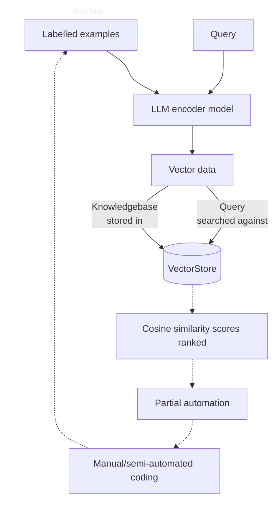

# ✨ NBS LLM Classifier ✨
This is an implementation of the [ClassifAI](https://datasciencecampus.github.io/classifai/) Python package that supports the semi-automatic classification of free text responses in the [NBS](https://nigerianstat.gov.ng/) Labour Force Survey to [ISCO](https://ilostat.ilo.org/methods/concepts-and-definitions/classification-occupation/) and [ISIC](https://ilostat.ilo.org/methods/concepts-and-definitions/classification-economic-activities/) coding schemes.

## Getting started

**1. Clone the repository**    
Open a terminal (Command Prompt) and run:
```bash
git clone https://github.com/datasciencecampus/NBS-LLM-classifier.git
cd NBS-LLM-classifier
```

**2. Set up your environment**    
Create and activate a virtual environment
```bash
python -m venv venv
venv\Scripts\activate.bat # on Windows
source venv/bin/activate # on a Mac
```

Install the required dependencies    
```bash
pip install -r requirements.txt
```

## Repository structure
```
├── data/
|   ├── input                    # ISCO/ISIC coding schemes and NLFS survey data
|   ├── knowledgebase            # ISCO/ISIC knowledgebase
|   └── query                    # ISCO/ISIC query
├── demo/                        # Example workflow
|   └── data/ 
│       └── input   
├── docs/                        # Additional documentation
├── outputs/                     # Search results
├── src/                         # Source code
|   └── nbs_llm_classifier/
│       ├── config.py            # Main configuration file
│       ├── evaluate.py          # Run classification metrics
│       ├── knowledgebase.py     # Create knowledgebase
│       ├── query.py             # Build input query
│       ├── search.py            # Search input query against vectorstore
│       └── vectorstore.py       # Build vectorstore
│   └── main.py                  # Run end-to-end pipeline
├── tests/                       # All tests (unit, integration, and end-to-end)
├── config.json                  # Pipeline settings and parameters
├── requirements.txt             # ClassifAI package and dependencies
```

## Workflow


1. The ISCO and ISIC classification schemes are combined with 4-digit coded occupations and economic activities from the Nigeria Labour Force Survey (NLFS) to create a knowledgebase.
2. These labelled examples are embedded as vectors and saved alongside the original free text as a VectorStore object. The transformation of text into numerical representations is handled by a vectoriser model. 
3. Query data from a different wave of the NLFS is also embedded as a vector and searched against the labelled examples in the VectorStore. 
4. The semantic similarity or distance between each vector query and knowledgebase entry is then calculated. 
5. The nearest N labelled examples are returned with their distance. <br />

## Input and outputs

### Inputs
The official ISCO and ISIC coding schemes are stored in `data/input` alongside the validated and prevalidated NLFS survey data. 

|Name |Source |URL |Type |Sheet| Columns |
|:-----|:-----|:-----|:-----|:-----|:-----|
|ISCO |ILO |[Link](https://www.ilo.org/ilostat-files/Documents/ISCO.xlsx) |.xlsx (81KB) |'ISCO_08' |`['major_label','sub_major_label','minor_label','unit','description']` | 
|ISIC |ILO |[Link](http://www.ilo.org/ilostat-files/Documents/ISIC.xlsx) |.xlsx (108KB) |'ISIC_Rev_4' |`['section_label','division_label','group_label','description','4-digits ']` |
|Validated NLFS |NBS |- |- |- |`['id','interview_id','hhnumber','hhroster_id','jobnumber','occupationname','occupationtasksduties','isco','activityname','activitygoodsservices','isic']` |
|Pre-validated NLFS |NBS |- |- |- |`['id','interview_id','hhnumber','hhroster_id','jobnumber','occupationname','occupationtasksduties','isco','activityname','activitygoodsservices','isic']` |

The `id` column in the NLFS data is a unique id that concatenates `interview_id`, `hhnumber`, `hhroster_id` and `jobnumber`.

### Intermediate outputs
The NBS LLM Classifier pipeline will generate a number of intermediate files. The ISCO/ISIC knowledgebase and queries will be vectorised as `kb_isco.csv` and `kb_isic.csv` in `data/knowledgebase` and `query_isco.csv` and `query_isic.csv` in  `data/query`. The corresponding vector stores are saved in `vector_store/isco` and `vector_store/isic`.

### Outputs
The NBS LLM Classifier pipeline will output 3 files in the `outputs/` folder: `search_results_isco.csv`, `search_results_isic.csv`, and `search_results_combined.csv`. The `search_results_combined.csv` file will have the following columns:

|Variable |Description |Example value |
|:-----|:-----|:-----|
|`id`|Joining variable |00090a7060624433b7b8f9edf3490878111 |
|`job_number` |Multiple job holders |1 |
|`isco_query_id` |Joining variable |00090a7060624433b7b8f9edf3490878111 |
|`isco_query` |Occupation |local government driver transporting clients from one destination to another, transporting goods |
|`isco_prevalidated`|Field interviewer recorded 4-digit ISCO code |8322 |
|`isco_pred1` |Top-1 4-digit ISCO prediction |8322 |
|`isco_pred1_label` |Top-1 4-digit ISCO prediction with label|8322 Car, Taxi and Van Drivers |
|`isco_pred1_score` |Top-1 4-digit ISCO prediction similarity score |0.828753829 |
|`isco_match_top_1` |Top-1 4-digit ISCO prediction matches pre-validated code |TRUE |
|`isco_pred2` |Top-2 4-digit ISCO prediction |8331 | 
|`isco_pred2_label` |Top-2 4-digit ISCO prediction with label |8331 Bus and Tram Drivers |
|`isco_pred3` |Top-3 4-digit ISCO prediction |8321 | 
|`isco_pred3_label` |Top-3 4-digit ISCO prediction |8321 Motorcycle Drivers|
|`isic_query_id` |Joining variable |00090a7060624433b7b8f9edf3490878111 | 
|`isic_query` |Economic activity |filling and keeping record, answering phone calls, welcoming and graeting guests, purchase tools and materials answering and directing phone calls, managing offices resources and supplies and filling |
|`isic_prevalidated` |Field interviewer recorded 4-digit ISIC code |8411 |
|`isic_pred1` |Top-1 4-digit ISIC prediction |5510 | 
|`isic_pred1_label` |Top-1 4-digit ISIC prediction with label |5510 Short term accommodation activities |
|`isic_pred1_score` |Top-1 4-digit ISIC prediction similarity score |0.65932399 |
|`isic_match_top_1` |Top-1 4-digit ISIC prediction matches pre-validated code |FALSE |
|`isic_pred2` |Top-2 4-digit ISIC prediction |8211 | 
|`isic_pred2_label` |Top-2 4-digit ISIC prediction with label |8211 Combined office administrative service activities |
|`isic_pred3` |Top-3 4-digit ISIC prediction |5610 |
|`isic_pred3_label` |Top-3 4-digit ISIC prediction with label |5610 Restaurants and mobile food service activities |

<br />If the Top-1 prediction matches the pre-validated 4-digit ISCO or ISIC code these will be autocoded. The remaining cases can be manually coded using the Top-1:3 predicted 4-digit codes. The manually coded cases can be added to the existing knowledgebase.

## Usage
1. Save source input files (`ISCO.xlsx`, `ISIC.xlsx`, validated and pre-validated NLFS survey data) in the `data/input` folder.
2. Edit the `config.json` file in the root folder. Please change the `model_name`, `n_results`, `nlfs_validated_csv` and `nlfs_prevalidated_csv` values if needed but leave the remaining values unchanged. 

```json
{
    "model_name":  "sentence-transformers/all-MiniLM-L6-v2",
    "n_results":  15,
    "paths":  {
                  "data_dir":  "data",
                  "raw_dir":  "data/input",
                  "preprocessed_dir":  "data/input",
                  "dictionaries_dir":  "data/knowledgebase",
                  "vector_store_dir":  "vector_store",
                  "isco_xlsx":  "data/input/ISCO.xlsx",
                  "isic_xlsx":  "data/input/ISIC.xlsx",
                  "nlfs_validated_csv":  "data/input/NLFS_2024Q1.csv",
                  "nlfs_prevalidated_csv":  "data/input/NLFS_2024Q2.csv",
                  "query_isco_file":  "data/query/query_isco.csv",
                  "query_isic_file":  "data/query/query_isic.csv",
                  "search_results_isco_file":  "outputs/search_results_isco.csv",
                  "search_results_isic_file":  "outputs/search_results_isic.csv",
                  "kb_isco_file":  "data/knowledgebase/kb_isco.csv",
                  "kb_isic_file":  "data/knowledgebase/kb_isic.csv"
              }
}
```

- `model_name`: The embedding model defaults to [Sentence Transformers's](https://huggingface.co/sentence-transformers) [`all-MiniLM-L6-v2`](https://huggingface.co/sentence-transformers/all-MiniLM-L6-v2) but you can just swap out the name for an alternative model from Hugging Face. In testing we have found that [Nomic-AI's](https://huggingface.co/nomic-ai) [`nomic-embed-text-v1.5`](https://huggingface.co/nomic-ai/nomic-embed-text-v1.5) performs very well.
- `n_results`: You can choose between 1 and 15 top results to return for each query. 15 is the default value.
- `nlfs_validated_csv`: Link to the clerically coded - 'gold standard' - NLFS reponses that will be added to the knowledgebase. 
- `nlfs_prevalidated_csv`: Link to the NLFS responses that need to be classified to ISCO/ISIC 4-digit codes.

3. Run `src/main.py` in the command-line interface.

```bash
python src/main.py all
```

If you want to run a particular step of the pipeline swap out `all` for `knowledgebase`, `vectorstore`, `query`, `search` or `evaluate`.

4. Check accuracy and coverage metrics.
5. Merge files in `/outputs` with raw data using joining variable.
6. Classify data by:
   a. *Partial automation + manual/semi-automated coding*. Cases can be automatically classified where the pre-validated code matches 'Prediction 1'. The remaining cases can be classified using the top-3 predicted codes.
   b. *Semi-automated coding*. The candidate ISCO/ISIC codes predicted by the model can be used to guide manual coding.
7. Save manually coded data and add to knowledgebase.

## Dependencies
[ClassifAI](https://datasciencecampus.github.io/classifai/) is the core Python package used in the NBS LLM Classifier pipeline. It uses semantic search over a knowledgebase of previously coded examples to classify free-text survey responses.
Please see `requirements.txt` for other runtime dependencies.

### Dependency and tooling files
- `requirements.txt` contains the dependencies needed to run the pipeline.
- `requirements-dev.txt` contains additional contributor tools such as pre-commit and Ruff. It does not replace `requirements.txt`.
- `pyproject.toml` stores Python tool configuration. In this repository, it configures Ruff linting and formatting.

## Configuration

### Pre-commit actions
This repository contains a configuration of pre-commit hooks for Python linting and formatting, generic file hygiene, and security checks such as detection of passwords and API keys. If approaching this project as a developer, activate your virtual environment, install the runtime dependencies from `requirements.txt`, then install and enable `pre-commit` by running the following in your shell:
   1. Install the additional developer dependencies:

      ```
      pip install -r requirements-dev.txt
      ```
   2. Enable `pre-commit`:

      ```
      pre-commit install
      ```
   3. Run the checks locally before opening a pull request:

      ```
      pre-commit run --all-files
      ```
Once pre-commit is activated, a series of checks will be executed whenever you commit. The configured hooks include Ruff linting and formatting for Python code, checks for security keys, checks for large files, and checks for unresolved merge conflict headers.

Most contributors should run Ruff through pre-commit. To run Ruff directly for a focused local check, use:

```
ruff check .
ruff check . --fix
ruff format .
```

**NOTE:** Pre-commit hooks execute Python, so it expects a working Python build.

## Contributing
We welcome contributions from internal and NSO colleagues! Please see [CONTRIBUTING.md](CONTRIBUTING.md) for guidelines on raising issues, opening branches, and submitting pull requests.

## Security
Please see [SECURITY.md](SECURITY.md) for information on reporting security vulnerabilities and our security policy.

## Data Science Campus
At the [Data Science Campus](https://datasciencecampus.ons.gov.uk/about-us/) we apply data science, and build skills, for public good across the UK and internationally. Get in touch with the Campus at [datasciencecampus\@ons.gov.uk](datasciencecampus@ons.gov.uk).

## License
See [LICENSE](LICENSE) for details.

## AI declaration
AI has been involved in the production of this content.