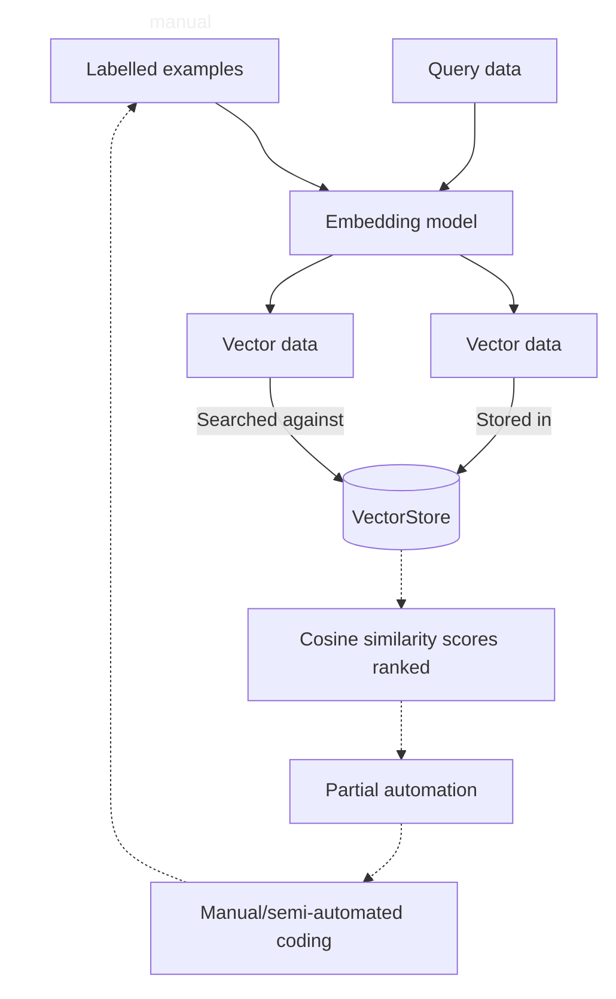

# ✨ NBS LLM Classifier ✨
This is an implementation of the [ClassifAI](https://github.com/datasciencecampus/classifai) Python package that supports the semi-automatic classification of free text fields in the [NBS](https://nigerianstat.gov.ng/) Labour Force Survey to [ISCO](https://ilostat.ilo.org/methods/concepts-and-definitions/classification-occupation/) and [ISIC](https://ilostat.ilo.org/methods/concepts-and-definitions/classification-economic-activities/) coding schemes.

## Folder Structure
```
├── data/
│   ├── pre-processed            # NLFS survey data
|   └── raw                      # ISCO/ISIC coding schemes
├── demo/                        # Example workflow
├── docs/                        # Additional documentation
├── outputs/                     # Seach results
├── src/                         # Source code
|   └── nbs_llm_classifier/ 
│       ├── config.py            # Pipeline settings and parameters
│       ├── evaluate.py          # Run classification metrics
│       ├── knowledgebase.py     # Create knowledgebase
│       ├── query.py             # Build input query
│       ├── search.py            # Search input query against vectorstore
│       └── vectorstore.py       # Build vectorstore
│   └── main.py                  # Run end-to-end pipeline
├── tests/                       # All tests (unit, integration, and end-to-end)
├── config.json                  # Pipeline settings and parameters
├── requirements.txt             # ClassifAI package and dependencies
```

## Installation

1. Clone the repository    

```bash
git clone https://github.com/datasciencecampus/NBS-LLM-classifier.git
cd NBS-LLM-classifier
```

2. Set up virtual environment    
A *virtual environment* allows you to manage the installation and updating of Python packages that are needed for your project without interfering with packages used by the system or by other projects.

If you are using Windows run this:
```bash
python -m venv venv
venv\Scripts\activate.bat
```

If you are on a Mac:

```bash
python -m venv venv
source venv/bin/activate
```

3. Install the required dependencies    
```bash
pip install -r requirements.txt
```

## Workflow


## Usage

1. Save knowledgebase (ISCO/ISIC coding schemes and manually labelled examples) and input query in `data/` subfolders.
2. Check `config.json` includes appropriate embedding model and points to the correct file paths.
3. Run `src/main.py` in the command-line interface.

```bash
python main.py all
```

4. Check accuracy and coverage metrics.
5. Merge `outputs/search_results.csv` file with raw data using joining variable.
6. Classify data by:   
   a. *Partial automation + manual/semi-automated coding*. Cases can be automatically classified where the pre-validated code matches 'Prediction 1'. The remaining cases can be classified using the top-3 predicted codes.   
   b. *Semi-automated coding*. The candidate ISCO/ISIC codes predicted by the model can be used to guide manual coding.   
7. Save manually coded data and add to knowledgebase.

## Dependencies
[ClassifAI](https://datasciencecampus.github.io/classifai/) is the core Python package used in the NBS LLM Classifier pipeline. It uses semantic search over a knowledgebase of previously coded examples to classify free-text survey responses.
Please see `requirements.txt` for other dependencies.

## Configuration

### Pre-commit actions
This repository contains a configuration of pre-commit hooks. These are language agnostic and focussed on repository security (such as detection of passwords and API keys). If approaching this project as a developer, you are encouraged to install and enable `pre-commits` by running the following in your shell:
   1. Install `pre-commit`:

      ```
      pip install pre-commit
      ```
   2. Enable `pre-commit`:

      ```
      pre-commit install
      ```
Once pre-commits are activated, whenever you commit to this repository a series of checks will be executed. The pre-commits include checking for security keys, large files and unresolved merge conflict headers. The use of active pre-commits are highly encouraged and the given hooks can be expanded with Python or R specific hooks that can automate the code style and linting. For example, the `flake8` and `black` hooks are useful for maintaining consistent Python code formatting.

**NOTE:** Pre-commit hooks execute Python, so it expects a working Python build.

## Contributing
We welcome contributions from internal and NSO colleagues! Please see [CONTRIBUTING.md](CONTRIBUTING.md) for guidelines on raising issues, opening branches, and submitting pull requests.

## Security
Please see [SECURITY.md](SECURITY.md) for information on reporting security vulnerabilities and our security policy.

## Data Science Campus
At the [Data Science Campus](https://datasciencecampus.ons.gov.uk/about-us/) we apply data science, and build skills, for public good across the UK and internationally. Get in touch with the Campus at [datasciencecampus\@ons.gov.uk](datasciencecampus@ons.gov.uk).

## License
See [LICENSE](LICENSE) for details.
